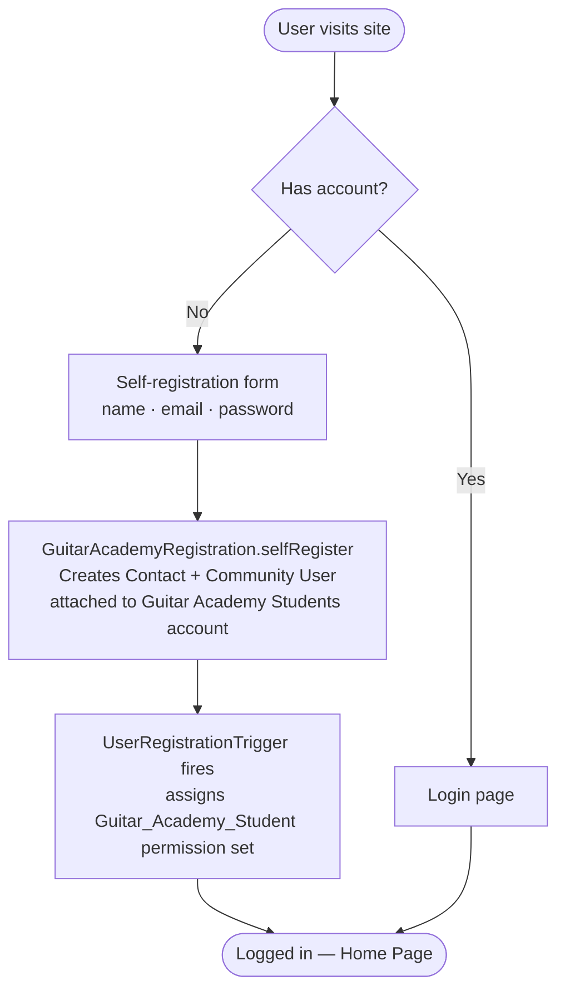
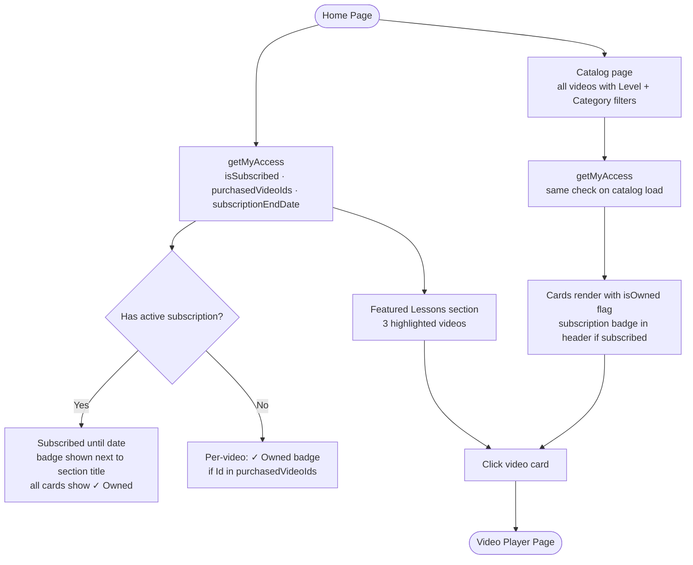
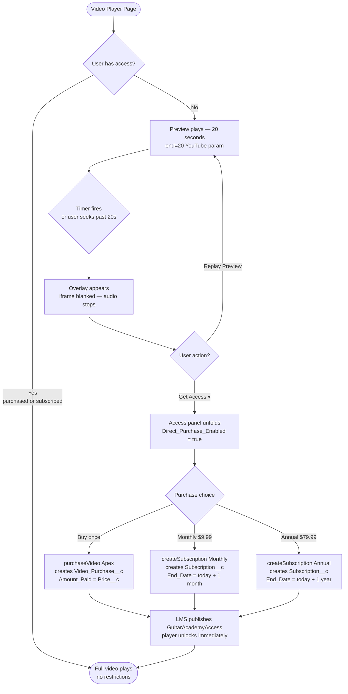
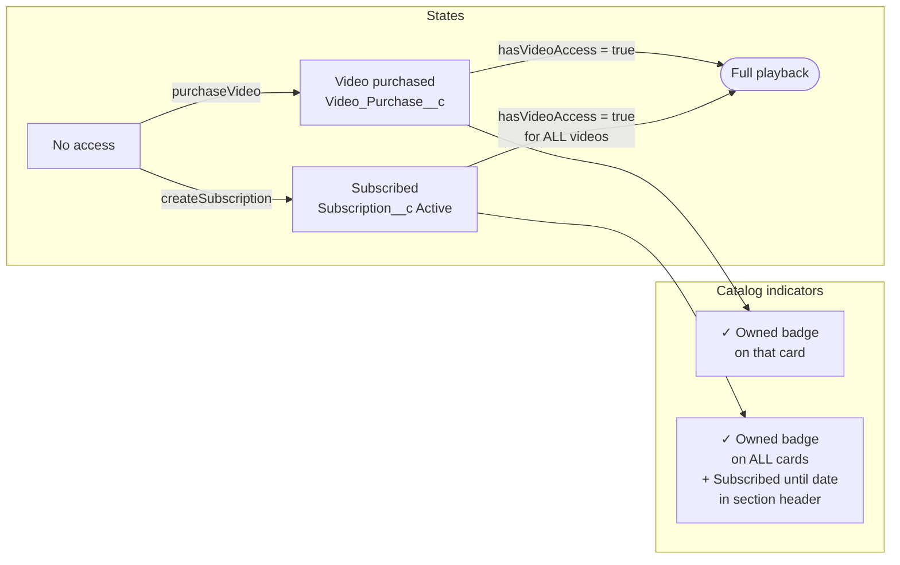
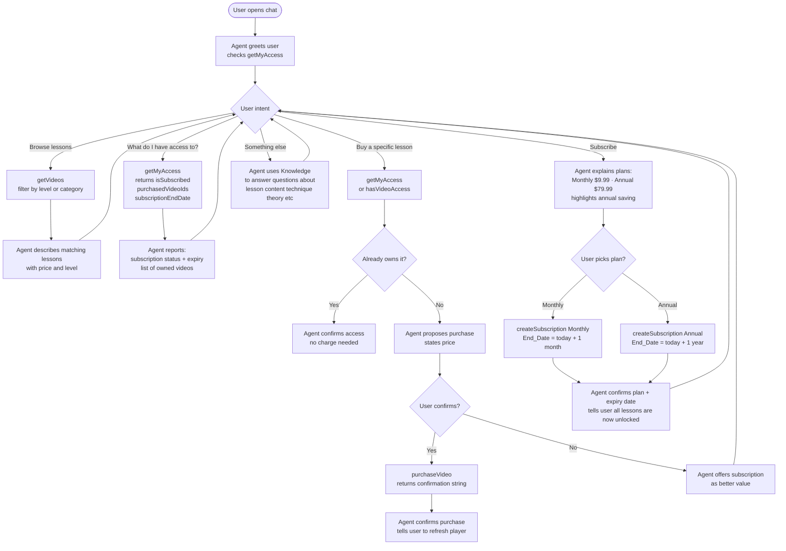

# Guitar Academy — Sales Flow Diagrams

Reference for Agentforce topic design, system prompt, and action wiring.

---

## 1. User Registration & Login

---

## 2. Browsing & Discovery

---

## 3. Video Access & Purchase Flow

---

## 4. Access State Summary

---

## 5. Agentforce Conversation Flow

---

## 6. Data Created Per Action

| User action | Apex method | Record created | Effect on UI |
|---|---|---|---|
| Buys a video | `purchaseVideo` | `Video_Purchase__c` | ✓ Owned on that card, player unlocks |
| Subscribes monthly | `createSubscription('Monthly')` | `Subscription__c` Active, End +1mo | ✓ Owned on all cards, header badge |
| Subscribes annually | `createSubscription('Annual')` | `Subscription__c` Active, End +1yr | same as above |
| Agent checks access | `getMyAccess` | — | informs agent response |
| Agent checks one video | `hasVideoAccess` | — | informs agent response |

---

## 7. Key Business Rules

- A user can only have **one active subscription** — `createSubscription` cancels any existing Active record before inserting the new one.
- A video purchase is **idempotent** — calling `purchaseVideo` twice for the same video does nothing the second time.
- Subscription grants access to **all videos** regardless of individual purchase history.
- The `Direct_Purchase_Enabled` custom label (`true`/`false`) gates the entire purchase UI — set to `false` to force all transactions through the agent.
- Preview is always **20 seconds** (`PREVIEW_SECONDS` constant in `guitarVideoPlayer.js`), enforced both by YouTube's `end=` param and by blanking the iframe when the JS timer fires.
